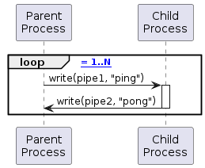
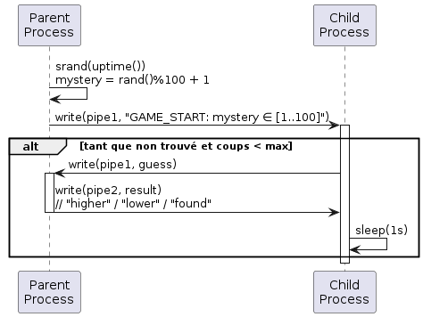
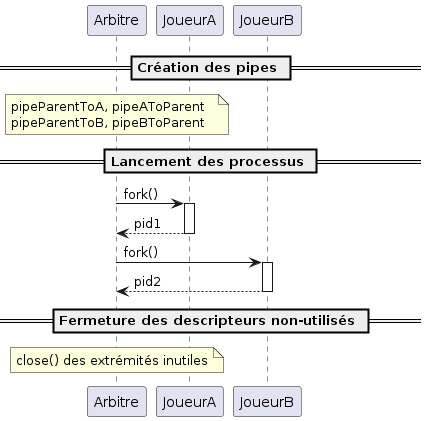
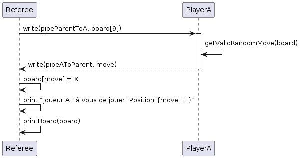
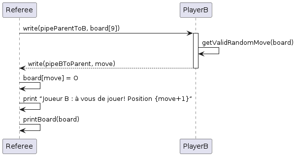
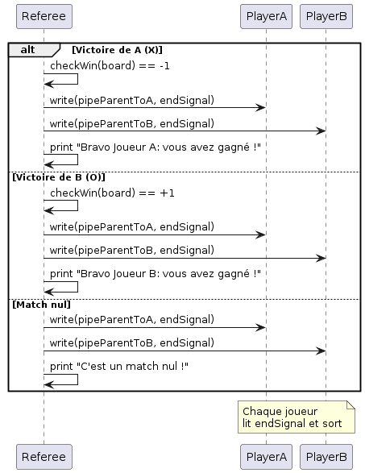

# Compte Rendu

**Nom** : Hugo Wendjaneh, Louis Maury, Fouad Id Gouahmane
**Date** : 05-05-2025
**Sujet** : Systèmes d'exploitation - Communications inter-processus
**Contexte** : OS XV6 Risc V

## 1. Objectif

L'objectif de ce TP est d'explorer et de mettre en œuvre les mécanismes de communication inter-processus (IPC) dans un environnement Unix, en utilisant le système d'exploitation éducatif XV6. À travers différents exemples de programmes, nous allons étudier comment les processus peuvent communiquer entre eux grâce aux pipes, qui sont l'un des mécanismes fondamentaux d'IPC dans les systèmes de type Unix.

## 2. TP 3: Réalisation

### 2.1 Programme Ping Pong

Ce programme démontre la communication bidirectionnelle entre un processus parent et son processus fils, en utilisant deux pipes, un pour chaque direction de communication. Le parent envoie "ping" et le fils répond avec "pong".

#### 2.1.1 Description du programme

Le programme `pingpong` permet de créer deux processus qui s'échangent des messages "ping" et "pong" via des pipes. Le processus parent commence par envoyer un "ping" au processus fils, qui répond par un "pong". Ce cycle se répète un nombre défini de fois (5 par défaut ou spécifié par l'utilisateur).

#### 2.1.2 Implémentation

```c
#include "kernel/types.h"
#include "kernel/stat.h"
#include "user/user.h"

#define MAX_PING_PONG 5

static void usage()
{
  fprintf(2, "Usage : pingpong <number of pong>. Default is 5\n");
  exit(1);
}

static int is_number(char *s)
{
  for(int i = 0; s[i] != '\0'; i++){
    if(s[i] < '0' || s[i] > '9'){
      return 0;
    }
  }
  return 1;
}

int
main(int argc, char *argv[])
{
  int number_of_ping_pong = MAX_PING_PONG;
  int p1[2], p2[2];

  if(argc > 2){
    usage();
  } else if(argc == 2){
    if(!is_number(argv[1])){
      usage();
    }
    number_of_ping_pong = atoi(argv[1]);
  }

  if(pipe(p1) < 0 || pipe(p2) < 0){
    fprintf(2, "pipe error\n");
    exit(1);
  }

  int pid = fork();

  if(pid < 0){
    fprintf(2, "fork error\n");
    exit(1);
  }

  // Processus enfant
  if(pid == 0){
    close(p1[1]); // Ferme le write end de pipe p1
    close(p2[0]); // Ferme le read end de pipe p2

    for(int i = 0; i < number_of_ping_pong; i++){
      char buf;
      if(read(p1[0], &buf, 1) != 1){
        break;
      }
      fprintf(1, "<child - PID : %d>  : send pong\n", getpid());
      write(p2[1], &buf, 1);
    }

    close(p1[0]);
    close(p2[1]);
    exit(0);
  }
  // Processus parent
  else {
    close(p1[0]); // Ferme le read end de pipe p1
    close(p2[1]); // Ferme le write end de pipe p2

    for(int i = 0; i < number_of_ping_pong; i++){
      sleep(10);

      fprintf(1, "<parent - PID : %d>  : send ping\n", getpid());

      char buf = 'x';
      write(p1[1], &buf, 1);

      if(read(p2[0], &buf, 1) != 1){
        break;
      }
    }

    close(p1[1]);
    close(p2[0]);

    wait(0);
    exit(0);
  }
}
```

#### 2.1.3 Diagramme UML de la communication

Le diagramme suivant illustre la communication entre le processus parent et le processus fils dans le programme pingpong :



Ce diagramme montre comment les messages sont échangés entre le parent et l'enfant à travers deux pipes distincts. Le parent envoie "ping" via p1, et le fils répond avec "pong" via p2.

### 2.2 Programme "Devine"

Ce programme implémente un jeu de devinette où le processus parent tire un nombre aléatoire entre 1 et 100, et le processus fils doit le deviner en utilisant une approche dichotomique.

#### 2.2.1 Description du programme

Le processus parent génère un nombre aléatoire et le processus fils tente de le deviner. Après chaque tentative du fils, le parent répond si le nombre proposé est trop grand, trop petit ou correct. La communication s'effectue via deux pipes : un pour envoyer les propositions du fils au père, et l'autre pour transmettre les indices du père au fils.

#### 2.2.2 Implémentation

```c
#include "kernel/types.h"
#include "kernel/stat.h"
#include "user/user.h"

#define MAX_NUMBER 100
#define MIN_NUMBER 1

static void usage() {
  fprintf(2, "Usage: devine <number of tries (> 0)>\n");
  exit(1);
}

static void generate_random_number(int *number) {
  uint32 r, seed = uptime();
  srand(seed);
  r = rand();
  *number = r % (MAX_NUMBER - MIN_NUMBER + 1) + MIN_NUMBER;
}

int main(int argc, char *argv[])
{
  if (argc != 2) {
    usage();
  }
  int tries = atoi(argv[1]);
  if (tries <= 0) {
    usage();
  }

  int max_tries = tries;

  int p1[2]; // fils -> père (guess)
  int p2[2]; // père -> fils (number)

  if (pipe(p1) < 0 || pipe(p2) < 0) {
    fprintf(2, "pipe error\n");
    exit(1);
  }
  int pid = fork();
  if (pid < 0) {
    fprintf(2, "fork error\n");
    exit(1);
  }

  tries = 0;

  if (pid != 0) {
    // Processus père
    close(p1[1]); // Ferme l'écriture
    close(p2[0]); // Ferme la lecture
    int mystery;
    generate_random_number(&mystery);

    printf("<parent - PID : %d> : Game start - mystery number between 1 to 100 : %d\n",
      getpid(), mystery);

    int guess, feedback;

    while(tries < max_tries) {
      // lire le nombre proposé par le fils
      if (read(p1[0], &guess, sizeof(guess)) != sizeof(guess)) {
        fprintf(2, "read error\n");
        exit(1);
      }
      tries++;
      if (guess > mystery) {
        feedback = 1; // trop grand
        fprintf(1, "<parent - PID : %d> : number given %d higher than mystery %d\n",
                       getpid(), guess, mystery);
      } else if (guess < mystery) {
        feedback = -1; // trop petit
        fprintf(1, "<parent - PID : %d> : number given %d lesser than mystery %d\n",
                       getpid(), guess, mystery);
      } else {
        feedback = 0; // gagné
        fprintf(1, "<parent - PID : %d> : number found %d == %d in %d %s!!!\n",
          getpid(), guess, mystery, tries,
          (tries > 1 ? "tries" : "try"));
      }

      // envoyer le feedback au fils
      if (write(p2[1], &feedback, sizeof(feedback)) != sizeof(feedback)) {
        fprintf(2, "write error\n");
        exit(1);
      }
      if (feedback == 0) break;
    }

    if (tries == max_tries) {
      fprintf(1, "<parent - PID : %d> : number not found in %d tries\n",
        getpid(), max_tries);
    }

    close(p1[0]);
    close(p2[1]);
    wait(0);
  } else {
    // Processus fils
    close(p1[0]);
    close(p2[1]);
    int guess, feedback;
    int min = MIN_NUMBER, max = MAX_NUMBER;
    while (tries < max_tries) {
      guess = (min + max) / 2;
      sleep(10);
      tries++;
      printf("<child - PID : %d> : send number (0 to 100) to parent --> %d\n",
        getpid(), guess);

      // envoyer le nombre proposé au père
      if (write(p1[1], &guess, sizeof(guess)) != sizeof(guess)) {
        fprintf(2, "write error\n");
        exit(1);
      }

      // lire le feedback du père
      if (read(p2[0], &feedback, sizeof(feedback)) != sizeof(feedback)) {
        fprintf(2, "read error\n");
        exit(1);
      }

      if (feedback == 1) {
        max = guess - 1;
      } else if (feedback == -1) {
        min = guess + 1;
      } else {
        break;
      }
    }

    close(p1[1]);
    close(p2[0]);
  }
  exit(0);
}
```

#### 2.2.3 Diagramme UML de la communication

Le diagramme suivant illustre le processus de communication dans le jeu "Devine" :



Ce diagramme montre comment le processus fils propose un nombre au processus parent, et comment le parent répond avec un indice pour guider le fils vers la bonne réponse.

### 2.3 Programme "OXO" (Morpion)

Ce programme implémente un jeu de morpion (Tic-Tac-Toe) où trois processus communiquent entre eux : un arbitre (parent) et deux joueurs (fils).

#### 2.3.1 Description du programme

L'arbitre initialise le jeu, affiche le plateau, vérifie les conditions de victoire ou de match nul, et gère les tours des joueurs. Les joueurs A et B choisissent aléatoirement des positions libres sur le plateau et communiquent leurs choix à l'arbitre. Le jeu se déroule jusqu'à ce qu'un joueur gagne ou que le plateau soit rempli (match nul).

#### 2.3.2 Implémentation

```c
#include "kernel/types.h"
#include "kernel/stat.h"
#include "user/user.h"
#include "kernel/fcntl.h"

#define BOARD_SIZE 9
#define EMPTY 9
#define PLAYER_X -1
#define PLAYER_O 1
#define WINNING_SUM 3

// Indice des pipes
#define READ 0
#define WRITE 1

void printBoard(int* board) {
  for (int i = 0; i < BOARD_SIZE; i++) {
    if (i > 0 && i % 3 == 0) {
      printf("\n");
    }

    if (board[i] == EMPTY) {
      printf("_ ");
    } else if (board[i] == PLAYER_X) {
      printf("X ");
    } else if (board[i] == PLAYER_O) {
      printf("O ");
    }

    if ((i + 1) % 3 == 0) {
      printf("\n");
    }
  }
  printf("\n");
}

int checkWin(int* board) {
  // Regarde les lignes
  for (int i = 0; i < 3; i++) {
    int rowSum = board[i*3] + board[i*3 + 1] + board[i*3 + 2];
    if (abs(rowSum) == WINNING_SUM) {
      return rowSum / WINNING_SUM;
    }
  }

  // Regarde les colonnes
  for (int i = 0; i < 3; i++) {
    int colSum = board[i] + board[i + 3] + board[i + 6];
    if (abs(colSum) == WINNING_SUM) {
      return colSum / WINNING_SUM;
    }
  }

  // Regarde les diagonales
  int diag1 = board[0] + board[4] + board[8];
  int diag2 = board[2] + board[4] + board[6];

  if (abs(diag1) == WINNING_SUM) {
    return diag1 / WINNING_SUM;
  }

  if (abs(diag2) == WINNING_SUM) {
    return diag2 / WINNING_SUM;
  }

  return 0;
}

int isDraw(int* board) {
  int sum = 0;
  for (int i = 0; i < BOARD_SIZE; i++) {
    sum += board[i];
  }

  return abs(sum) == 1;
}

int isGameOver(int* board) {
  return (checkWin(board) != 0) || isDraw(board);
}

int getValidRandomMove(int* board) {
  int emptyCells[BOARD_SIZE];
  int count = 0;

  // Trouver les cases vides
  for (int i = 0; i < BOARD_SIZE; i++) {
    if (board[i] == EMPTY) {
      emptyCells[count++] = i;
    }
  }

  // Si aucune case vide, retourner -1
  if (count == 0) {
    return -1;
  }

  // Générer un nombre aléatoire
  uint32 r, seed = uptime();
  srand(seed);
  r = rand();

  // Choisir une case vide aléatoire
  int randomIndex = r % count;
  return emptyCells[randomIndex];
}

void playAsReferee(int* board, int pipeToA[2], int pipeFromA[2],
                   int pipeToB[2], int pipeFromB[2]) {
  int currentPlayer = PLAYER_X; // X commence
  int move;
  int winner = 0;

  printBoard(board);

  while (!isGameOver(board)) {
    if (currentPlayer == PLAYER_X) {
      // Demander le coup du joueur X
      write(pipeToA[WRITE], board, sizeof(int) * BOARD_SIZE);
      read(pipeFromA[READ], &move, sizeof(int));

      if (move >= 0 && move < BOARD_SIZE && board[move] == EMPTY) {
        board[move] = PLAYER_X;
        printf("Joueur A : à vous de joueur! Position %d\n", move + 1);
      }
    } else {
      // Demander le coup du joueur O
      write(pipeToB[WRITE], board, sizeof(int) * BOARD_SIZE);
      read(pipeFromB[READ], &move, sizeof(int));

      if (move >= 0 && move < BOARD_SIZE && board[move] == EMPTY) {
        board[move] = PLAYER_O;
        printf("Joueur B : à vous de joueur! Position %d\n", move + 1);
      }
    }

    printBoard(board);

    currentPlayer = -currentPlayer;

    sleep(10);
  }

  winner = checkWin(board);
  if (winner == PLAYER_X) {
    printf("Bravo Joueur A: vous avez gagné la partie!\n");
  } else if (winner == PLAYER_O) {
    printf("Bravo Joueur B: vous avez gagné la partie!\n");
  } else {
    printf("C'est un match nul!\n");
  }

  // Envoyer un signal de fin aux joueurs
  int endSignal = -99;
  write(pipeToA[WRITE], &endSignal, sizeof(int));
  write(pipeToB[WRITE], &endSignal, sizeof(int));
}

void playAsPlayerA(int pipeToParent[2], int pipeFromParent[2]) {
  int board[BOARD_SIZE];
  int move;

  while (1) {
    if (read(pipeFromParent[READ], board, sizeof(int) * BOARD_SIZE) <= 0) {
      break;
    }

    if (board[0] == -99) {
      break;
    }

    move = getValidRandomMove(board);
    write(pipeToParent[WRITE], &move, sizeof(int));
  }
}

void playAsPlayerB(int pipeToParent[2], int pipeFromParent[2]) {
  int board[BOARD_SIZE];
  int move;

  while (1) {
    if (read(pipeFromParent[READ], board, sizeof(int) * BOARD_SIZE) <= 0) {
      break;
    }

    if (board[0] == -99) {
      break;
    }

    move = getValidRandomMove(board);
    write(pipeToParent[WRITE], &move, sizeof(int));
  }
}


int main(int argc, char *argv[])
{
  int board[BOARD_SIZE];
  int pipeParentToA[2], pipeAToParent[2];
  int pipeParentToB[2], pipeBToParent[2];
  int pid1, pid2;

  // Créer le tableau de jeu
  for (int i = 0; i < BOARD_SIZE; i++) {
    board[i] = EMPTY;
  }

  // Créer les pipes
  if (pipe(pipeParentToA) < 0 || pipe(pipeAToParent) < 0 ||
      pipe(pipeParentToB) < 0 || pipe(pipeBToParent) < 0) {
    printf("Erreur lors de la création des pipes\n");
    exit(1);
  }

  // Joueur (A - X)
  pid1 = fork();
  if (pid1 < 0) {
    printf("Erreur lors de la création du joueur X\n");
    exit(1);
  }

  if (pid1 == 0) {
    // Child process (Joueur A - X)
    close(pipeParentToA[WRITE]);
    close(pipeAToParent[READ]);
    close(pipeParentToB[READ]);
    close(pipeParentToB[WRITE]);
    close(pipeBToParent[READ]);
    close(pipeBToParent[WRITE]);

    playAsPlayerA(pipeAToParent, pipeParentToA);
    exit(0);
  }

  // Joueur (B - O)
  pid2 = fork();
  if (pid2 < 0) {
    printf("Erreur lors de la création du joueur B\n");
    kill(pid1);
    exit(1);
  }

  if (pid2 == 0) {
    // Child process (Joueur B - O)
    close(pipeParentToB[WRITE]);
    close(pipeBToParent[READ]);
    close(pipeParentToA[READ]);
    close(pipeParentToA[WRITE]);
    close(pipeAToParent[READ]);
    close(pipeAToParent[WRITE]);

    playAsPlayerB(pipeBToParent, pipeParentToB);
    exit(0);
  }

  // Parent process (Joueur - Referee)
  close(pipeParentToA[READ]);
  close(pipeAToParent[WRITE]);
  close(pipeParentToB[READ]);
  close(pipeBToParent[WRITE]);

  playAsReferee(board, pipeParentToA, pipeAToParent, pipeParentToB, pipeBToParent);

  // Attendre la fin des joueurs
  wait(0);
  wait(0);

  exit(0);
}
```

#### 2.3.3 Diagrammes UML de la communication

Plusieurs diagrammes UML ont été conçus pour illustrer les différentes phases du jeu OXO :

1. **Initialisation du jeu** : Création des pipes et des processus



2. **Tour du Joueur A** : Communication entre l'arbitre et le joueur A



3. **Tour du Joueur B** : Communication entre l'arbitre et le joueur B



4. **Fin de partie** : Signalement de la fin du jeu aux joueurs



Ces diagrammes montrent comment les trois processus communiquent entre eux via des pipes, et comment l'arbitre gère le déroulement du jeu.

## 3. Analyse et discussion

### 3.1 Utilisation des pipes pour la communication inter-processus

Les pipes sont un mécanisme fondamental de communication inter-processus dans les systèmes Unix. Dans nos programmes, nous avons utilisé des pipes unidirectionnels pour établir des canaux de communication entre les processus. Chaque pipe possède une extrémité de lecture et une extrémité d'écriture, ce qui permet une communication à sens unique.

Pour établir une communication bidirectionnelle, comme dans le programme pingpong, nous avons utilisé deux pipes : un pour envoyer des messages du parent vers l'enfant, et un autre pour envoyer des messages de l'enfant vers le parent.

### 3.2 Gestion des descripteurs de fichiers

La fermeture des descripteurs de fichiers non utilisés est une pratique importante dans la programmation système. Dans nos programmes, nous avons fermé systématiquement les extrémités des pipes que nous n'utilisions pas. Cette pratique permet d'éviter les fuites de ressources et les problèmes de synchronisation.

### 3.3 Synchronisation des processus

Dans les programmes que nous avons développés, la synchronisation entre les processus est assurée par les opérations de lecture et d'écriture sur les pipes. Lorsqu'un processus tente de lire à partir d'un pipe vide, il est bloqué jusqu'à ce que des données soient disponibles. De même, lorsqu'un processus tente d'écrire dans un pipe plein, il est bloqué jusqu'à ce que de l'espace soit disponible.

Cette synchronisation naturelle est particulièrement visible dans le programme pingpong, où le parent et l'enfant s'attendent mutuellement pour échanger des messages.

## 4. Conclusion

Ce TP nous a permis d'explorer en profondeur les mécanismes de communication inter-processus à travers l'utilisation des pipes dans le système d'exploitation XV6. Les trois programmes que nous avons développés illustrent différentes façons d'utiliser les pipes pour établir des communications entre les processus.

Le programme pingpong démontre une communication bidirectionnelle simple entre un processus parent et son enfant. Le programme devine met en œuvre une communication plus complexe où les processus échangent des données structurées pour jouer à un jeu de devinette. Enfin, le programme OXO pousse le concept encore plus loin en orchestrant la communication entre trois processus pour simuler un jeu de morpion.

À travers ces implémentations, nous avons acquis une compréhension pratique des concepts fondamentaux des IPC dans les systèmes Unix, notamment la création et l'utilisation des pipes, la gestion des descripteurs de fichiers, et la synchronisation des processus.
